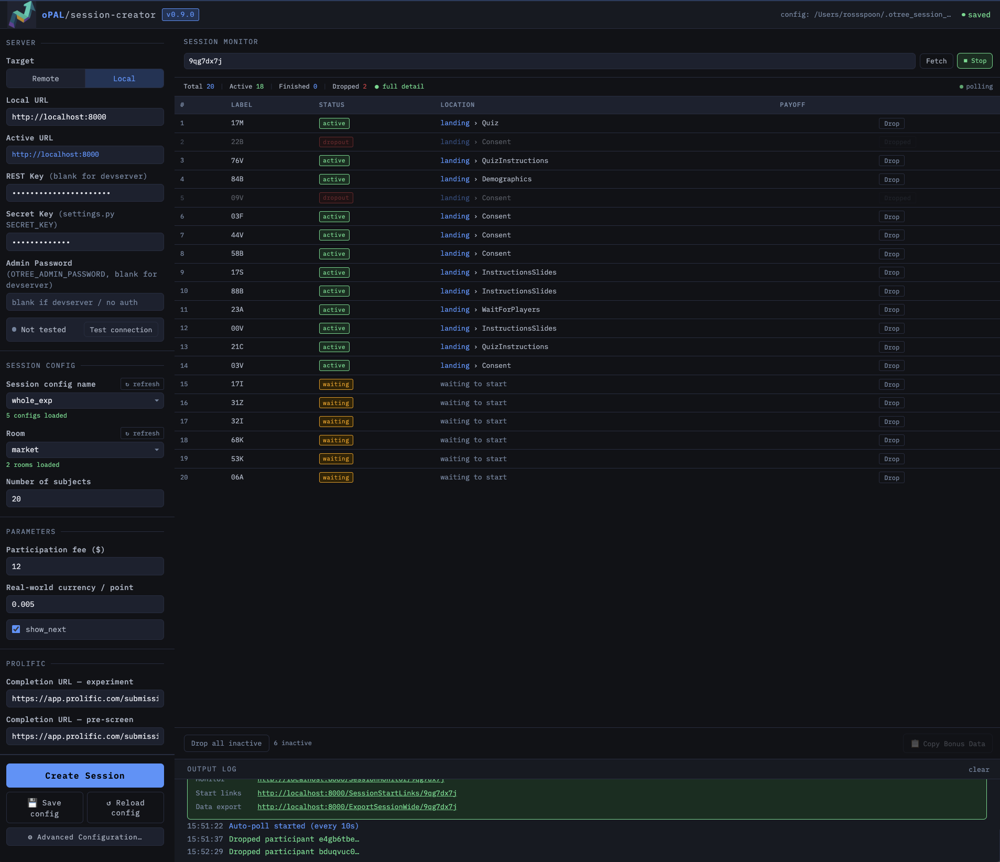

# oPAL Session Creator / Monitor

**v0.9.0** — A lightweight desktop GUI for creating and monitoring oTree experiment sessions via the REST API. Built as a companion tool for asset market experiments running on oTree 5.11, deployed locally or on Heroku.



## Overview

Managing oTree sessions through the built-in admin interface works fine for simple use cases, but becomes cumbersome during live experiments that require rapid session creation with precise configuration, real-time participant monitoring, and dropout management. This tool provides a single-window interface that handles all of that without leaving the browser.

The app runs as a local Flask server and opens automatically in your default browser. It communicates with your oTree server (local devserver or remote Heroku) through the oTree REST API and the wide CSV export endpoint.

## Requirements

- Python 3.8 or higher
- oTree 5.11 (the rich participant export relies on the `ExportSessionWide` endpoint introduced in this version)
- An oTree server running locally (`otree devserver`) or remotely (e.g. Heroku)

## Setup

Install dependencies (one time only):

```
pip install flask requests
```

Or using the requirements file:

```
pip install -r requirements.txt
```

## Running

Double-click `launcher.py`, or from a terminal:

```
python launcher.py
```

The app opens automatically at `http://localhost:5055`. Close the terminal window or press Ctrl-C to stop it.

## File Structure

```
otree_launcher/
├── launcher.py        ← entry point; double-click to run
├── app.py             ← Flask backend (REST proxy + config API)
├── requirements.txt
├── LICENSE
├── README.md
└── static/
    └── index.html     ← full browser UI
```

## Configuration

All settings are saved automatically to a JSON file on your machine:

- **Mac/Linux:** `~/.otree_session_creator.json`
- **Windows:** `C:\Users\<you>\.otree_session_creator.json`

The path is shown in the top-right corner of the app. Settings persist across sessions so you only configure once.

## Features

### Session Creation

Select a session config, room, and number of subjects, then click **Create Session**. The app sends the full set of session config parameters to oTree via the REST API, overriding defaults as needed. Parameters are organized into a main pane (the settings you change most often) and an **Advanced Configuration** overlay (timing, market structure, forecasting, margin settings, etc.).

Supported session configs out of the box: `whole_exp`, `prescreen`, `market`, `market_test`, `landing`.

### Session Monitor

Enter a session code to load a live participant table showing:

- Participant label and ID
- Status (waiting, active, finished, dropped)
- Current app, page, and round (requires `current_round` in `PARTICIPANT_FIELDS` — see below)
- Payoff

The monitor polls automatically on a configurable interval (indicated by the **polling** indicator in the top-right of the monitor pane). Individual participants can be dropped manually, or all inactive participants can be dropped at once with **Drop all inactive**. Payoff data can be copied to the clipboard via **Copy Bonus Data** for payment processing.

#### Round Number Display

oTree's wide CSV export does not include an explicit round number column. To display the current round in the monitor, add `current_round` to `PARTICIPANT_FIELDS` in your `settings.py` and update it at the start of each round in your app:

```python
# settings.py
PARTICIPANT_FIELDS = [..., 'current_round']

# In your page or subsession, update at the start of each round:
self.participant.current_round = self.round_number
```

### REST Key

**Remote server (Heroku):** Set `OTREE_REST_KEY` as a config var on Heroku and paste the value into the REST Key field.

**Local devserver:** Leave the REST Key field blank. The devserver allows unauthenticated API access by default unless you have set `OTREE_AUTH_LEVEL`.

If you have set `OTREE_AUTH_LEVEL=DEMO` or `STUDY` locally, set `OTREE_REST_KEY` in your environment before starting oTree:

```bash
# Mac/Linux
export OTREE_REST_KEY=your-secret-key
otree devserver

# Windows (PowerShell)
$env:OTREE_REST_KEY = "your-secret-key"
otree devserver
```

### Secret Key

The **Secret Key** field must match the `SECRET_KEY` value in your oTree project's `settings.py`:

```python
# settings.py
SECRET_KEY = 'your-secret-key-here'
```

oTree uses this key internally to generate a hash that authenticates access to the `ExportSessionWide` CSV export endpoint. The session creator replicates this hash computation locally to construct the correct export URL without requiring admin credentials. This is what enables the rich participant monitoring features — specifically, the live display of each participant's current app, page, and round during an active session. Without a correct Secret Key, the monitor falls back to the basic REST API, which provides less detail about participant status.

## Compatibility Note

This tool targets **oTree 5.11** specifically. The participant monitor uses the `ExportSessionWide` CSV export endpoint, which may behave differently across oTree versions. The REST API endpoints for session creation and participant management follow the oTree 5.x REST specification.

## License

MIT License — see [LICENSE](LICENSE) for details.

## Author

Ross Spoon  
Virginia Polytechnic Institute & State University
